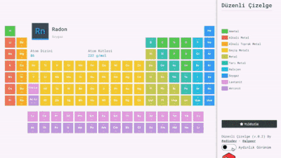
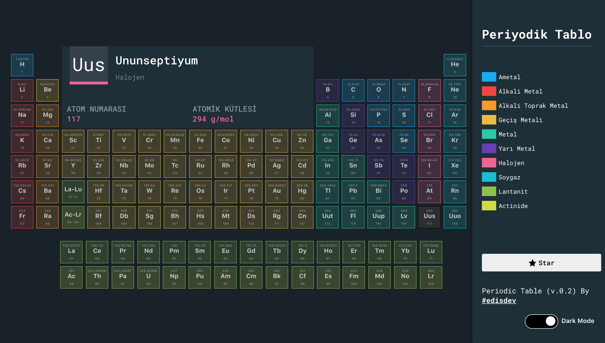
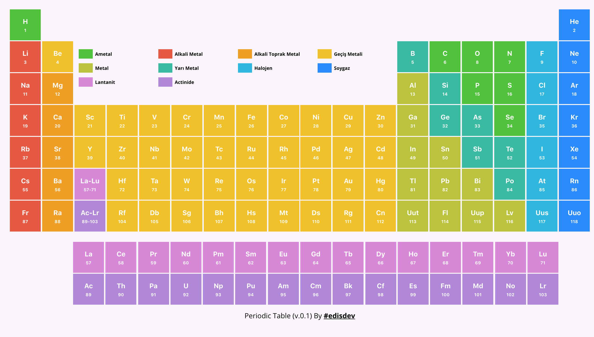

# 🎉 Düzenli Çizelge 🎉

Kimya derslerinde kullanmak için periyodik tablo(düzenli çizelge).

> Periodic Table to use on chemistry lessons






## Özellikler

1. 🇹🇷 Uluslararasılaştırma 
1. 💡 Aydınlık/Koyu Görünüm 
1. 📚 g/mol bilgisi 
1. 🎯 Türlere Göre Kümeleme 

## Geliştiriciler

||||
|-|-|-|
|| Hatice Edis | [@edisdev](https://github.com/edisdev)|
|| Alper Kürşat | [@alpeer](https://github.com/alpeer)|

## Yeterge

2018 © MIT Yetergesi ile dağıtılmaktadır.
> Copyright © 2018 Licensed under MIT.

## Tasarı kurulumu 

> Project setup

```
yarn install
```

### Geliştirme için derleme ve anlık yenileme 

> Compiles and hot-reloads for development

```
yarn run serve
```

### Üretim için derleme ve küçültme

> Compiles and minifies for production

```
yarn run build
```

### Belgeleri ayıklama ve düzeltme

> Lints and fixes files

```
yarn run lint
```
